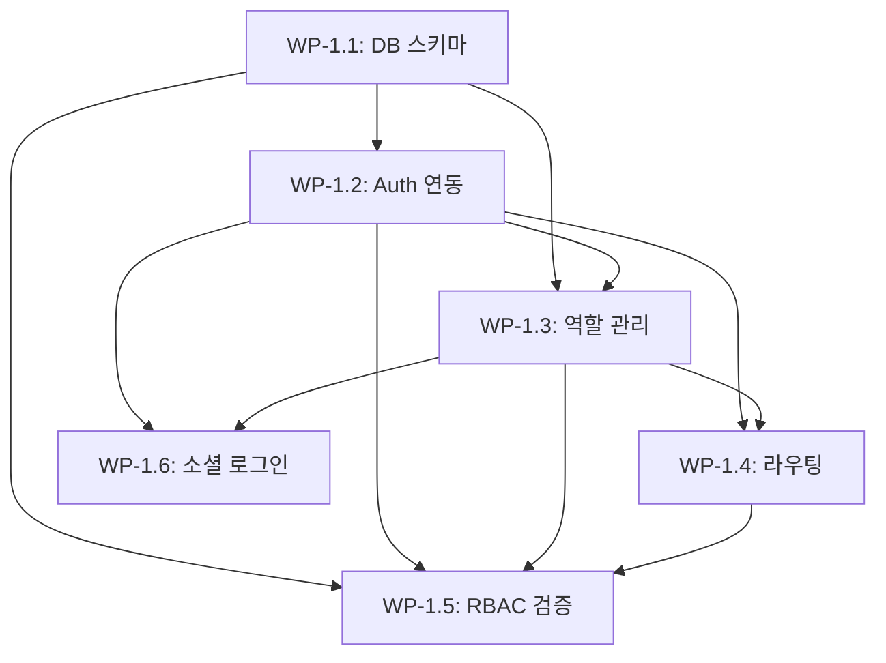

# Milestone 1: 인증 및 핵심 인프라 - Work Package 분해

## 개요

**Milestone 목표**: 3-Tier 계정 구조 및 데이터베이스 설계 완성

**예상 기간**: 2주 (10일)

**완료 기준**: 팬/셀럽/매니저 각각 회원가입 후 역할에 맞는 화면 진입, DB 스키마 완성, RLS 정책 검증 완료

---

## Work Package 구조

```
WP-1.1: 데이터베이스 스키마 설계 및 생성
WP-1.2: Supabase Auth 기본 연동 및 회원가입/로그인
WP-1.3: 사용자 프로필 및 역할 관리 시스템
WP-1.4: 역할 기반 라우팅 및 Navigation 구현
WP-1.5: RBAC 구현 및 권한 검증
WP-1.6: 소셜 로그인 연동 (선택)
```

---

## WP-1.1: 데이터베이스 스키마 설계 및 생성

### 목표

데이터베이스 스키마를 설계하고 Supabase에 테이블을 생성하여 데이터 저장 기반 구축

### 사용자 가치

데이터를 안전하게 저장하고 조회할 수 있는 기반 제공

### 작업 내용

1. **ERD 설계 문서 작성**

   - `docs/database/ERD.md` 작성
   - 테이블 관계도 및 필드 정의
   - 주요 테이블:
     - `users` (id, email, role, created_at, updated_at)
     - `questions` (id, user_id, content, like_count, is_hidden, created_at)
     - `answers` (id, question_id, celebrity_id, content, created_at)
     - `communities` (id, user_id, title, content, created_at)
     - `subscriptions` (id, fan_id, celebrity_id, created_at)

2. **Supabase SQL 마이그레이션 스크립트 작성**

   - `supabase/migrations/001_initial_schema.sql` 생성
   - 테이블 생성 (CREATE TABLE)
   - 외래키 제약조건 설정
   - 인덱스 생성 (성능 최적화)

3. **RLS(Row Level Security) 정책 설정**

   - 각 테이블별 RLS 활성화
   - 역할별 접근 권한 정책:
     - 팬: 자신의 질문/구독 조회/작성 가능
     - 셀럽: 질문 조회, 자신의 답변 작성/수정 가능
     - 매니저: 모든 데이터 조회, 질문 숨기기 가능

4. **마이그레이션 실행 및 검증**

   - Supabase Dashboard에서 SQL 실행
   - 테이블 생성 확인
   - RLS 정책 테스트

### 완료 조건

- [ ] ERD 문서 작성 완료
- [ ] 모든 테이블이 Supabase에 생성됨
- [ ] RLS 정책이 적용되어 권한별 접근 제어 작동
- [ ] 샘플 데이터 삽입 테스트 성공

### 산출물

- `docs/database/ERD.md`
- `supabase/migrations/001_initial_schema.sql`
- Supabase 테이블 스크린샷

### 예상 소요 시간

1.5일

---

## WP-1.2: Supabase Auth 기본 연동 및 회원가입/로그인

### 목표

Supabase Auth를 Flutter 앱에 연동하고 기본 회원가입/로그인 화면 구현

### 사용자 가치

사용자가 이메일/비밀번호로 계정을 생성하고 로그인할 수 있음

### 작업 내용

1. **Supabase Auth 설정**

   - `lib/core/supabase_config.dart` 수정
   - Auth 초기화 코드 추가
   - 세션 관리 로직 구현

2. **회원가입 화면 구현**

   - `lib/features/auth/screens/signup_screen.dart` 생성
   - 이메일, 비밀번호 입력 폼
   - 유효성 검증
   - Supabase Auth 회원가입 API 호출

3. **로그인 화면 구현**

   - `lib/features/auth/screens/login_screen.dart` 생성
   - 이메일, 비밀번호 입력 폼
   - Supabase Auth 로그인 API 호출
   - 에러 처리 (잘못된 자격증명 등)

4. **인증 상태 관리**

   - `lib/features/auth/providers/auth_provider.dart` 생성 (Provider 사용)
   - 로그인 상태 관리
   - 세션 유지 로직

5. **테스트**

   - 회원가입 성공/실패 케이스 테스트
   - 로그인 성공/실패 케이스 테스트

### 완료 조건

- [ ] 이메일/비밀번호로 회원가입 가능
- [ ] 로그인 후 세션이 유지됨
- [ ] 로그아웃 기능 작동
- [ ] 에러 메시지가 사용자에게 표시됨

### 산출물

- `lib/features/auth/screens/signup_screen.dart`
- `lib/features/auth/screens/login_screen.dart`
- `lib/features/auth/providers/auth_provider.dart`
- 회원가입/로그인 화면 스크린샷

### 예상 소요 시간

1.5일

### 의존성

- WP-1.1 (데이터베이스 스키마)

---

## WP-1.3: 사용자 프로필 및 역할 관리 시스템

### 목표

사용자 프로필 정보를 관리하고 역할(fan/celebrity/manager)을 설정하는 시스템 구현

### 사용자 가치

회원가입 시 역할을 선택하고, 프로필 정보를 저장하여 역할별 기능에 접근 가능

### 작업 내용

1. **회원가입 시 역할 선택 화면**

   - `lib/features/auth/screens/role_selection_screen.dart` 생성
   - 팬/셀럽/매니저 선택 UI
   - 선택한 역할을 Users 테이블에 저장

2. **사용자 프로필 모델 및 서비스**

   - `lib/features/auth/models/user_model.dart` 생성
   - `lib/features/auth/services/user_service.dart` 생성
   - Supabase에서 사용자 정보 조회/업데이트 로직

3. **프로필 정보 저장**

   - 회원가입 완료 후 Users 테이블에 레코드 생성
   - Auth UID와 Users 테이블 연결
   - 기본 프로필 정보 저장 (닉네임, 역할 등)

4. **현재 사용자 정보 조회**

   - 로그인 시 사용자 프로필 정보 로드
   - Provider에 사용자 정보 저장

### 완료 조건

- [ ] 회원가입 시 역할 선택 가능
- [ ] 선택한 역할이 Users 테이블에 저장됨
- [ ] 로그인 후 현재 사용자 정보 조회 가능
- [ ] 역할 정보가 앱 전역에서 접근 가능

### 산출물

- `lib/features/auth/screens/role_selection_screen.dart`
- `lib/features/auth/models/user_model.dart`
- `lib/features/auth/services/user_service.dart`
- 역할 선택 화면 스크린샷

### 예상 소요 시간

1일

### 의존성

- WP-1.1 (데이터베이스 스키마)
- WP-1.2 (Supabase Auth 연동)

---

## WP-1.4: 역할 기반 라우팅 및 Navigation 구현

### 목표

Go Router를 사용하여 역할별로 다른 화면으로 라우팅하고, 공통 Navigation 컴포넌트 구현

### 사용자 가치

로그인 후 자신의 역할에 맞는 화면으로 자동 이동하여 즉시 서비스 이용 가능

### 작업 내용

1. **Go Router 설정**

   - `lib/core/router/app_router.dart` 생성
   - 라우트 정의:
     - `/login`, `/signup`, `/role-selection` (인증)
     - `/fan/home`, `/fan/questions`, `/fan/community` (팬)
     - `/celebrity/dashboard`, `/celebrity/answers` (셀럽)
     - `/manager/dashboard`, `/manager/monitoring` (매니저)

2. **역할별 라우팅 로직**

   - 로그인 후 사용자 역할 확인
   - 역할에 따라 적절한 화면으로 리다이렉트
   - 미인증 사용자는 로그인 화면으로 리다이렉트

3. **공통 UI 컴포넌트**

   - `lib/shared/widgets/app_bar.dart` 생성
   - `lib/shared/widgets/bottom_navigation.dart` 생성
   - 역할별로 다른 Navigation 메뉴 표시

4. **역할별 홈 화면 (기본 구조)**

   - `lib/features/fan/screens/fan_home_screen.dart` 생성
   - `lib/features/celebrity/screens/celebrity_dashboard_screen.dart` 생성
   - `lib/features/manager/screens/manager_dashboard_screen.dart` 생성
   - 각 화면에 기본 레이아웃만 구현 (내용은 이후 WP에서 추가)

5. **인증 가드 구현**

   - 라우트 보호 로직
   - 인증되지 않은 사용자 접근 차단

### 완료 조건

- [ ] 팬 회원가입 후 팬 홈 화면으로 이동
- [ ] 셀럽 회원가입 후 셀럽 대시보드로 이동
- [ ] 매니저 회원가입 후 매니저 대시보드로 이동
- [ ] 로그아웃 시 로그인 화면으로 이동
- [ ] 각 역할별 Navigation 메뉴가 표시됨

### 산출물

- `lib/core/router/app_router.dart`
- `lib/shared/widgets/app_bar.dart`
- `lib/shared/widgets/bottom_navigation.dart`
- 역할별 홈 화면 파일들
- 역할별 화면 스크린샷

### 예상 소요 시간

1.5일

### 의존성

- WP-1.2 (Supabase Auth 연동)
- WP-1.3 (사용자 프로필 및 역할 관리)

---

## WP-1.5: RBAC 구현 및 권한 검증

### 목표

Row Level Security 정책을 검증하고, 클라이언트 측에서도 권한을 체크하여 안전한 접근 제어 구현

### 사용자 가치

권한이 없는 기능에 접근할 수 없어 보안이 강화되고, 각 역할에 맞는 기능만 사용 가능

### 작업 내용

1. **RLS 정책 검증 테스트**

   - 각 역할별로 Supabase에서 직접 쿼리 테스트
   - 팬이 다른 사용자의 질문 수정 불가 확인
   - 셀럽이 질문 조회만 가능하고 수정 불가 확인
   - 매니저가 모든 데이터 조회 가능 확인

2. **권한 체크 유틸리티**

   - `lib/shared/utils/permission_checker.dart` 생성
   - 역할별 권한 체크 함수
   - 화면/기능 접근 전 권한 검증

3. **권한 기반 UI 표시**

   - 권한이 없는 기능은 UI에서 숨김
   - 버튼/메뉴 비활성화 처리

4. **에러 처리**

   - 권한 없는 접근 시도 시 에러 메시지
   - 적절한 화면으로 리다이렉트

### 완료 조건

- [ ] RLS 정책이 모든 테이블에서 작동함
- [ ] 팬은 자신의 질문만 수정 가능
- [ ] 셀럽은 질문 조회만 가능하고 수정 불가
- [ ] 매니저는 모든 데이터 조회 가능
- [ ] 권한 없는 기능 접근 시 에러 처리됨

### 산출물

- `lib/shared/utils/permission_checker.dart`
- RLS 정책 테스트 결과 문서
- 권한 검증 테스트 케이스

### 예상 소요 시간

1일

### 의존성

- WP-1.1 (데이터베이스 스키마 및 RLS)
- WP-1.2 (Supabase Auth)
- WP-1.3 (사용자 프로필 및 역할)
- WP-1.4 (라우팅)

---

## WP-1.6: 소셜 로그인 연동 (선택)

### 목표

Google 및 Apple 소셜 로그인을 구현하여 사용자 편의성 향상

### 사용자 가치

이메일/비밀번호 입력 없이 간편하게 로그인 가능

### 작업 내용

1. **Google 로그인 설정**

   - Google Cloud Console에서 OAuth 클라이언트 생성
   - Supabase에서 Google Provider 활성화
   - Flutter에서 Google Sign-In 패키지 설정

2. **Apple 로그인 설정 (iOS)**

   - Apple Developer에서 Sign in with Apple 설정
   - Supabase에서 Apple Provider 활성화
   - Flutter에서 Apple Sign-In 패키지 설정

3. **소셜 로그인 UI 구현**

   - 로그인 화면에 소셜 로그인 버튼 추가
   - Google/Apple 로그인 플로우 구현

4. **역할 선택 통합**

   - 소셜 로그인 후에도 역할 선택 화면 표시
   - 기존 사용자는 역할 선택 생략

### 완료 조건

- [ ] Google 로그인으로 회원가입/로그인 가능
- [ ] Apple 로그인으로 회원가입/로그인 가능 (iOS)
- [ ] 소셜 로그인 후 역할 선택 가능
- [ ] 기존 계정과 연동 가능

### 산출물

- 소셜 로그인 버튼이 포함된 로그인 화면
- 소셜 로그인 설정 문서

### 예상 소요 시간

1일

### 의존성

- WP-1.2 (Supabase Auth 기본 연동)
- WP-1.3 (역할 관리)

---

## Work Package 의존성 다이어그램



---

## 실행 순서 (권장)

### Phase 1: 데이터베이스 기반 구축 (필수)

1. WP-1.1: 데이터베이스 스키마 설계 및 생성

### Phase 2: 인증 시스템 구축 (필수)

2. WP-1.2: Supabase Auth 기본 연동 및 회원가입/로그인
3. WP-1.3: 사용자 프로필 및 역할 관리 시스템

### Phase 3: 사용자 경험 구축 (필수)

4. WP-1.4: 역할 기반 라우팅 및 Navigation 구현

### Phase 4: 보안 강화 (필수)

5. WP-1.5: RBAC 구현 및 권한 검증

### Phase 5: 편의 기능 (선택)

6. WP-1.6: 소셜 로그인 연동

---

## Milestone 1 완료 검증

다음 조건을 모두 만족해야 Milestone 1이 완료된 것으로 간주:

- [ ] 팬 계정으로 회원가입 후 팬 홈 화면 진입 성공
- [ ] 셀럽 계정으로 회원가입 후 셀럽 대시보드 진입 성공
- [ ] 매니저 계정으로 회원가입 후 매니저 대시보드 진입 성공
- [ ] DB 스키마가 ERD 문서와 일치
- [ ] RLS 정책으로 권한 분리 검증 완료
- [ ] 각 역할별로 적절한 Navigation 메뉴 표시

---

## 예상 소요 시간 요약

| WP ID | 제목 | 소요 시간 | 의존성 | 우선순위 |
|-------|------|-----------|--------|----------|
| WP-1.1 | DB 스키마 설계 및 생성 | 1.5일 | 없음 | P0 |
| WP-1.2 | Auth 기본 연동 | 1.5일 | WP-1.1 | P0 |
| WP-1.3 | 역할 관리 시스템 | 1일 | WP-1.1, WP-1.2 | P0 |
| WP-1.4 | 라우팅 및 Navigation | 1.5일 | WP-1.2, WP-1.3 | P0 |
| WP-1.5 | RBAC 검증 | 1일 | 전체 | P0 |
| WP-1.6 | 소셜 로그인 | 1일 | WP-1.2, WP-1.3 | P1 |
| **합계** | | **7.5일** (필수: 6.5일) | | |

**버퍼**: 2.5일 (예비 시간)

---

## Vertical Slicing 원칙 적용

각 Work Package는 다음 원칙을 따릅니다:

1. **사용자 가치 전달**: 각 WP 완료 시 사용자가 실제로 사용할 수 있는 기능 제공

   - WP-1.2: 회원가입/로그인 가능
   - WP-1.3: 역할 선택 및 프로필 저장 가능
   - WP-1.4: 역할에 맞는 화면 진입 가능

2. **완결성**: 각 WP 종료 시 "동작하는" 상태

   - WP-1.1: 데이터 저장/조회 가능
   - WP-1.2: 인증 플로우 완성
   - WP-1.4: 전체 앱 네비게이션 작동

3. **독립적 테스트 가능**: 각 WP는 별도로 테스트 가능

   - 각 WP마다 완료 조건과 검증 방법 명시
   - 단계별로 기능이 누적되어 최종 목표 달성

